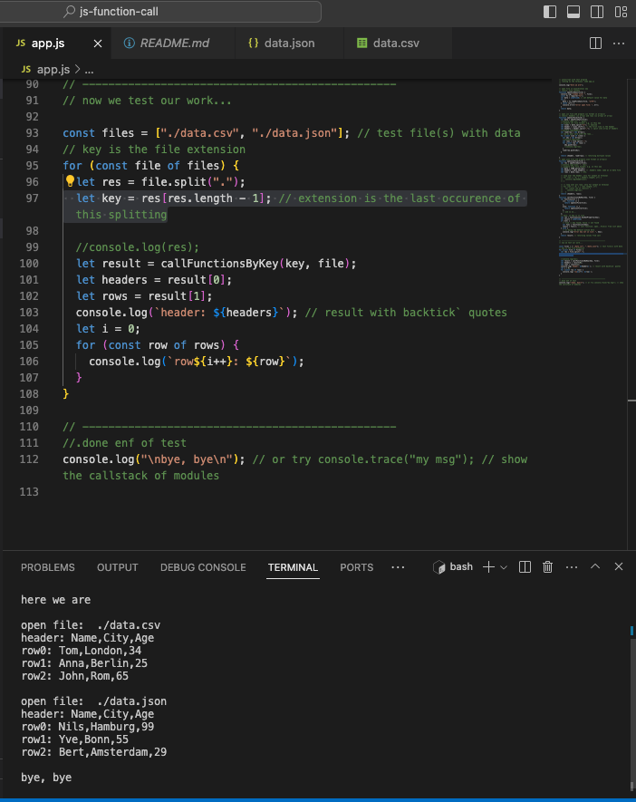

# js-function-call

This program calls different functions (from a list) depending on the file externsion.

- csv -> openCsvFile
- json -> openJsonFile
  The file content is prepared for output (E.g header as an array and rows as an array of arrays for this csv file.)
  There are two files (data.csv and data.json in the same folder as app.js) for testing this app program.
  

